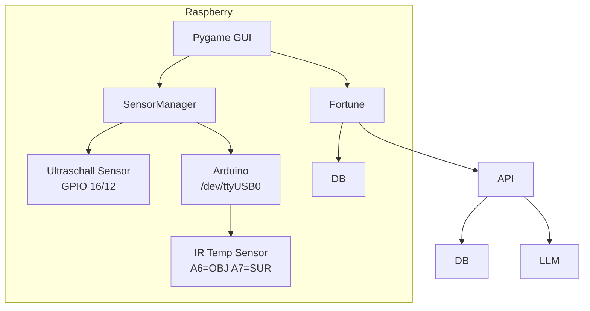

# Das Orakel von Selphi

Spaßprojekt für BITI Mobile Computing, Wahrsager-Automat mit problematischer Persönlichkeit. Die Schicksale werden von einem Large Language Model freier Wahl kreiert und über das grafische User Interface angezeigt.
Damit die Wahrsagungen individuelle bleiben, wird bei der Aktivierung durch einen Distanz-Messer auf einer dafür vorgesehenen Interaktionsfläche, die Distanz der Hand zum Sensor gemessen und die Temperatur der Handfläche. Kombiniert ergibt sich ein normalisierter Wert, der die Persönlichkeit des Orakels ergibt. Weiters werden die Ausgaben desselben Tages an das KI-Modell übermittelt, damit sich die Wahrsagungen immer voneinander unterscheiden.

Die Anforderungen sind sehr simpel gestaltet, eine interagierende Person soll durch die Text-Hinweise auf dem Bildschirm eine Lesung lostreten, nachdem die Generierung abgeschlossen ist, wird das Schicksal verlautbart und nach einer festgelegten Zeit gelangt das Programm wieder in den Startzustand zurück und wartet auf die nächste Aktivierung.

---

## Architektur



**SensorManager** (`utils/sensor_manager.py`) ist die zentrale Schaltstelle. Wenn `BOARD=raspi` gesetzt ist, werden echte Sensoren verwendet — sonst simulierte Zufallswerte für Entwicklung und Tests.

**Fortune** (`utils/classes/Fortune.py`) orchestriert die Generierung: Sensorwert → Persönlichkeit (mood) → Prompt → REST API → Ergebnis. Läuft in einem eigenen Thread, damit die GUI nicht blockiert.

**Fallback**: Schlägt die API fehl, greift das Orakel auf frühere, lokal gespeicherte Wahrsagungen aus der SQLite-Datenbank zurück.

## Hardware Komponenten

| Komponente | Details |
|---|---|
| Raspberry Pi 5 | Hauptrechner, GPIO, USB-Host |
| HDMI Display | Vollbild-GUI |
| HC-SR04 | Ultraschall-Distanzsensor (Hand-Erkennung) |
| Seeed Studio Grove IR Sensor v1.2 | Infrarot-Temperatursensor |
| Arduino Nano Klon (CH340) | ADC-Wandler: analog → digital → USB-Seriell |
| 3D-gedruckte Abdeckung | Gehäuse-Oberseite |

Raspberry Pi, Bildschirm und Distanzsensor sind Teil des Joy-IT Raspberry Pi Koffers.

## Software Komponenten

| Komponente                                                                                  | Zweck |
|---------------------------------------------------------------------------------------------|---|
| [Raspberry Pi OS Lite (Debian 13)](https://www.raspberrypi.com/software/operating-systems/) | Base-OS |
| Python 3                                                                               | Applikationssprache |
| Pygame 2.x                                                                                  | Grafisches User Interface |
| FastAPI                                                                                     | REST API Server für LLM-Routing |
| OpenAI Python Client                                                                        | LLM-Kommunikation (OpenAI-kompatibel) |
| Arduino CLI                                                                                 | Kompilieren & Flashen des IR-Sensor-Sketches |
| Docker                                                                                      | Containerisiertes API-Server-Image |
| SQLite                                                                                      | Lokale Fallback-Datenbank |

---

## Schritt-für-Schritt Anleitung

Vorraussetzung sind: 
- ein Raspberry Pi mit Raspberry Pi OS
- Per HDMI angeschlossenes Display
- Seeed grove IR Temperatur Sensor
- HC-SR04 Ultraschall Distanzsensor
- Arduino (in diesem Szenario ein Arduino nano Klon)

### 1. Dependencies

Installation per
```shell
sudo apt-get update
sudo apt-get install -y \
  python3-dev \
  python3-pygame \
  python3-dotenv \
  gcc \
  libgpiod-dev \
  swig \
  liblgpio-dev \
  libegl1 \
  libegl-mesa0 \
  libgles2 \
  libgbm1 \
  libdrm2 \
  git
```

**Wichtig**: `python3-pygame` aus den apt-Repositories installieren, nicht per pip. Das apt-Paket ist gegen die systemweiten SDL2-Bibliotheken gelinkt und funktioniert zuverlässig mit Hardware-Beschleunigung.

---

### 2. Arduino CLI installieren

Der Arduino Nano braucht die `arduino-cli` zum Kompilieren und Flashen. Man kann es aber auch per Arduino IDE von einem anderen Rechner flashen.

```shell
# Binary herunterladen
curl -fsSL https://raw.githubusercontent.com/arduino/arduino-cli/master/install.sh | BINDIR=/usr/local/bin sh

# AVR Core für Arduino Nano installieren
arduino-cli core install arduino:avr

# Prüfen
arduino-cli version
```
---

### 3. Repository klonen

```shell
git clone https://github.com/getzingo/biti-oracle.git
cd the-oracle
```

---

### 4. Python Virtual Environment

Es ist üblich virtuelle Umgebungen für Python Entwicklung zu nehmen, um nicht das OS zu korrumpieren.

```shell
### Im Ordner des Python Projekts
# Komponenten kreieren
python3 -m venv venv

# Venv aktivieren
source venv/bin/activate

# Deaktivieren
deactivate
```

---

### 6. Umgebungsvariablen konfigurieren

Die Datei `env` im Projekt-Root muss angelegt werden (sie ist nicht in Git, weil sie Secrets enthält):

```shell
cp env.example env   # falls vorhanden, sonst händisch:
```

```ini
# env im Projekt-Root
ORACLE_API_SERVER_URL=https://<API-SERVER-IP>:<PORT>/
ORACLE_API_SERVER_TOKEN=<TOKEN>
BOARD=raspi
```

Falls der API-Server lokal auf demselben Pi läuft:
```ini
ORACLE_API_SERVER_URL=http://127.0.0.1:<PORT>/
```

**`BOARD=raspi`** ist der Schalter: Nur wenn diese Variable gesetzt ist, werden echte GPIO- und serielle Sensoren verwendet. Ohne sie läuft das Orakel im Simulationsmodus (Zufallswerte), wichtig für Development.

---

### 7. Verdrahtung

#### Arduino & Temperatur-Sensor

| Grove Pin | Farbe | Funktion | Arduino Pin |
|---|---|---|---|
| 1 | Rot | VCC (3–5V) | 5V |
| 2 | Schwarz | GND | GND |
| 3 | Gelb | OBJ (Objekttemperatur) | A6 |
| 4 | Weiß | SUR (Umgebungstemperatur) | A7 |

Arduino per USB-Kabel mit dem Raspberry Pi verbinden. Nach dem Einstecken sollte `/dev/ttyUSB0` erscheinen:

```shell
ls -la /dev/ttyUSB0
# crw-rw---- 1 root dialout ... /dev/ttyUSB0
```

Falls nicht: `dmesg | tail -20` zeigt an, ob der CH340-Chip erkannt wurde.

#### Ultraschall-Distanzsensor (HC-SR04)

Im Joy-IT Pi-Koffer ist der HC-SR04 bereits fix mit dem Raspberry Pi verbunden:

| HC-SR04 Pin | Raspberry Pi GPIO (BCM) |
|---|---|
| VCC | 5V (Pin 2) |
| GND | GND (Pin 6) |
| Trig | GPIO 16 (Pin 36) |
| Echo | GPIO 12 (Pin 32) |

### 8. Arduino Sketch flashen

Der Sketch `utils/ir_sensor/ir-read.ino` liest A6 und A7 im 1-Sekunden-Takt, mittelt über 10 Samples und sendet die Werte als Textzeile über die serielle Schnittstelle:

```
IR:A6=450,A7=512
IR:A6=451,A7=513
...
```

Wie man das Arduino per CLI flasht, ist etwas komplizierter, [offizielle Docs](https://docs.arduino.cc/arduino-cli/) konsultieren!

Einfacher geht es mit der [offiziellen IDE](https://docs.arduino.cc/software/ide/).


Das Skript sucht automatisch nach dem Arduino-Port. Ausgabe sollte so aussehen:

```
[INFO]  Looking for Arduino on /dev/ttyUSB0 ...
[INFO]  Compiling sketch ...
[INFO]  Uploading to /dev/ttyUSB0 ...
[INFO]  Flash complete! Board should start sending data at 9600 baud.
```

Testen ob Daten ankommen:

```shell
python3 -c "import serial; s=serial.Serial('/dev/ttyUSB0', 9600, timeout=2); print(s.readline())"
# b'IR:A6=448,A7=510\r\n'
```

---

### 9. IR Sensor kalibrieren

Der Sensor meldet Rohwerte (0–1023), die in °C umgerechnet werden müssen. Die Kalibrierung erfolgt in zwei Stufen:

**a) Umgebungstemperatur (NTC-Thermistor an A7)**

Der Sketch liest A7, die `calibration.py` rechnet den ADC-Wert über die NTC-Widerstandstabelle in °C um. Der Parameter `temp_calibration` in `sensor_manager.py` korrigiert die Selbst-Erwärmung des NTC. Standard ist `-2.6` (ermittelt bei 24.5°C Raumtemperatur).

**b) Objekttemperatur (Thermopile an A6)**

Die Thermopile-Spannung wird über eine [2D-Lookup-Tabelle des Herstellers](https://github.com/Seeed-Studio/Digital_Infrared_Temperature_Sensor_MLX90615) (13×12 Matrix, -10°C bis 110°C) in Objekttemperatur übersetzt.
Die Kalibrierparameter stehen in `utils/ir_sensor/config.yaml`:

```yaml
reference_vol: "0.472"   # Thermopile-Nullpunkt (V)
offset_vol: "0.014"      # Kalibrier-Offset (V)
temp_range: "10.0"       # Temperaturschritt der Tabelle
```

**So kalibriert man den Sensor neu:**

1. Raumtemperatur mit einem Referenzthermometer messen (z.B. 22.5°C)
2. `python3 utils/ir_sensor/sensor.py` laufen lassen
3. Die `ambient_c`-Werte beobachten. Weichen sie ab, `temp_calibration` im `SensorManager` anpassen
4. Eine Hand vor den Sensor halten. `object_c` sollte ~2°C über der Umgebung liegen
5. Passt der Nullpunkt nicht, `reference_vol` in `config.yaml` justieren

Die aktuellen Werte sind kalibriert für den ATmega168 Nano-Klon bei 24.5°C Raumtemperatur (Mai 2026).

---

### 10. API Server aufsetzen

Der API-Server (`utils/api/server/oracle_api.py`) ist eine FastAPI-Applikation, die eingehende Fortune-Anfragen entgegennimmt,
an ein LLM weiterleitet und das Ergebnis zurückgibt.
Er kann lokal auf dem Pi direkt ausgeführt werden oder auf einem separaten Server laufen.
Als Client wird die Library Openai verwendet, sehr viele Provider sind kompatibel mit diesem Protokoll.

Der Server braucht ein paar ENVs damit er läuft, zB. für OpenAI API:

```ini
# utils/api/server/env
DEV_MODE=False
OAI_TOKEN=sk-dein-llm-api-key
OAI_COMPATIBLE_API_URL=https://api.openai.com/v1
OAI_MODEL=gpt-4o
ORACLE_API_SERVER_TOKEN=<GLEICHER TOKEN WIE Fortune()>
```

**DEV_MODE=True** deaktiviert die HMAC-Signatur-Prüfung, für lokale Setups ok. Für öffentliche Adressen auf `False` setzen.

Um das Dockerfile im Repo zu verwenden für ein containerisiertes Deployment:

```shell
# Image bauen
docker build -t oracle-api:latest -f Dockerfile .

# Container starten
docker run -d \
  --name oracle-api \
  -p <EXTERNER PORT>:80 \
  -e DEV_MODE=False \
  -e OAI_TOKEN=sk-dein-llm-api-key \
  -e OAI_COMPATIBLE_API_URL=https://api.openai.com/v1 \
  -e OAI_MODEL=gpt-4o \
  -e ORACLE_API_SERVER_TOKEN=<GLEICHER TOKEN WIE Fortune()> \
  oracle-api:latest

# Logs prüfen
docker logs -f oracle-api
```

---

### 11. GUI starten — Das Orakel läuft

```shell
cd ~/the-oracle
source venv/bin/activate
BOARD=raspi python3 main.py
```

Das Orakel startet im Vollbild. Der Ablauf:

1. **Idle**: Titelbildschirm mit Kristallkugel, Sternen, Pyramide mit Auge. Die blinkende Aufforderung „~ Bitte Hand auflegen ~" erscheint.
2. **Sensing**: Hand wurde erkannt (Ultraschall). Eine zufällige Dauer zwischen `sensing_min_duration_seconds` und `sensing_max_duration_seconds` (konfigurierbar in `config.yaml`, default 3–15s). Währenddessen pulsiert die Kristallkugel und zufällige Sprüche wie „Hmmmm" oder „Wow, spiritually valuable!" erscheinen. Parallel startet bereits die Fortune-Generierung per API.
3. **Generating**: Das Orakel konsultiert das Jenseits. Die GUI zeigt „THE ORACLE is about to speak ...". Sobald die API-Antwort da ist (oder der Timeout greift), wechselt die Anzeige.
4. **Fortune**: Die Wahrsagung wird bildschirmfüllend angezeigt — mit Gold-Text auf violett-orange-farbenem Gradient-Hintergrund. Nach `display_fortune_duration_seconds` (default 30s) zurück zu Idle.

**Beenden**: `ESC` oder `Ctrl+C`.

---

### 12. Prompt-Persönlichkeiten

Die 5 Persönlichkeiten des Orakels sind in `utils/api/client/MoodInstructions.py` definiert. Jede hat eigene Beispiel-Sprüche und Stil-Vorgaben:

| Sensorwert | Stimmung | Charakter |
|---|---|---|
| 0–20 | gentle | Sanft, fürsorglich — das Grauen kommt leise |
| 21–40 | dramatic | Theatralisch, monumentale Ernsthaftigkeit |
| 41–60 | cynical | Müde, abgeklärt — „Ich hab das alles schon gesehen" |
| 61–80 | chaotic | Assoziativ, traumlogisch — „etwas im Getränkeautomaten weiß deinen Stundenplan" |
| 81–100 | obliterating | Skalpell-scharf — nennt den wahren Charakterfehler |

Kalte Hände (0–20) bedeuten also ein sanftes Orakel, warme Hände (81–100) ein vernichtendes. Der Prompt enthält harte Regeln: *ein Satz, maximal 25 Wörter, keine Emojis, nicht mit "I" beginnen, nur die Prophezeiung ausgeben.*

Die Beispiele aus den MoodInstructions lohnen sich zu lesen — sie geben den Ton vor:

> *„The version of you that finishes things lives in a different timeline."* (obliterating)
> *„The library printer saved one copy. It is still there."* (gentle)

---

## Gehäuse & 3D-Druck

Die Oberseite des Orakels ist ein 3D-gedrucktes Cover. Die STL-Dateien sind Teil des Repos. Die Grundfläche sollte folgende Aussparungen haben:
